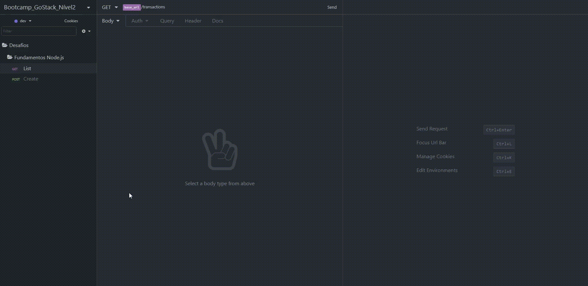
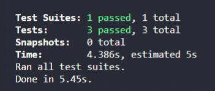

<h1 align="center">
  🚀 Fundamentos do Node.js 🚀
</h1>

<h3 align="center">
Desafio do Nível 2 sobre Fundamentos do Node.js aplicado no bootcamp GoStack da Rocketseat
</h3>

<h1>
  
</h1>

## Índice

- [Sobre](#-sobre)
- [Tecnologia utilizada](#-tecnologia-utilizada)
- [Objetivos](#-objetivos)
- [Testes de Validação](#-testes-de-validação)
- [Para clonar e executar o projeto](#-para-clonar-e-executar-o-projeto)
- [Para executar os testes](#-para-executar-os-testes)

---

## 🔖 Sobre

O propósito deste Desafio é criar uma aplicação que deve armazenar transações financeiras de entrada e saída e que deve permitir o cadastro e a listagem dessas transações. Aqui foi trabalhado tudo o que foi aprendido sobre **Node.js** junto ao **TypeScript**, utilizando o conceito de **models**, **repositories** e **services**!

---

## 🚀 Tecnologia utilizada

- [NodeJS](https://nodejs.org/en/)
- [TypeScript](https://www.typescriptlang.org/)

---

## 🎯 Objetivos

Os objetivos deste desafio foram atingir os propósitos de cada rota:

- **POST /transactions:**
A rota deve receber `title`, `value` e `type` dentro do corpo da requisição, sendo `type` o tipo da transação, que deve ser `income` para entradas (depósitos) e `outcome` para saidas (retiradas). Ao cadastrar uma nova transação, ela deve ser armazenada dentro de um objeto com segiondo o formato abaixo:
``` json
  {
    "id": "uuid",
    "title": "Salário",
    "value": 3000,
    "type": "income"
  }
```

- **GET /transactions:**
Essa rota deve retornar uma listagem com todas as transações cadastradas até o momento, junto com o valor de soma de entradas, retiradas e total de crédito. Essa rota deve retornar um objeto com o formato a seguir:
``` json
{
  "transactions": [
    {
      "id": "uuid",
      "title": "Salário",
      "value": 4000,
      "type": "income"
    },
    {
      "id": "uuid",
      "title": "Freela",
      "value": 2000,
      "type": "income"
    },
    {
      "id": "uuid",
      "title": "Pagamento da fatura",
      "value": 4000,
      "type": "outcome"
    },
    {
      "id": "uuid",
      "title": "Cadeira Gamer",
      "value": 1200,
      "type": "outcome"
    }
  ],
  "balance": {
    "income": 6000,
    "outcome": 5200,
    "total": 800
  }
}
```

---

## 📝 Testes de Validação



Para que o desafio seja válido, a aplicação teve que passar por três testes, que foram:

- **Seja possível criar uma nova transação:**
Para que esse teste passe, a aplicação deve permitir que uma transação seja criada, e retorne um json com a transação criada.

- **Seja possível listar as transações:**
Para que esse teste passe, a aplicação deve permitir que seja retornado um objeto contendo todas as transações junto ao balanço de income, outcome e total das transações que foram criadas até o momento.

- **Não seja possível realizar uma retirada se não houver saldo suficiente:**
Para que esse teste passe, sua aplicação não deve permitir que uma transação do tipo `outcome` extrapole o valor total que o usuário tem em caixa, retornando uma resposta com código HTTP 400 e uma mensagem de erro no seguinte formato: `{ error: string }`

---

## ⚙ Para clonar e executar o projeto

```bash
  # clonar o projeto
  $ git clone https://github.com/DigooDS/fundamentos-nodejs.git

  # acessar o projeto
  $ cd fundamentos-nodejs

  # para instalar todas as dependências
  $ yarn

  # para iniciar o servidor (back-end)
  $ yarn dev:server

```

---

## 🛠 Para executar os testes

```bash
  $ yarn test
```

---

<i>Desenvolvido por RodrigoDS</i> 🤓
